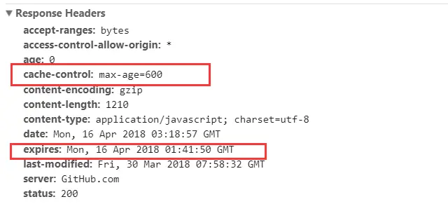
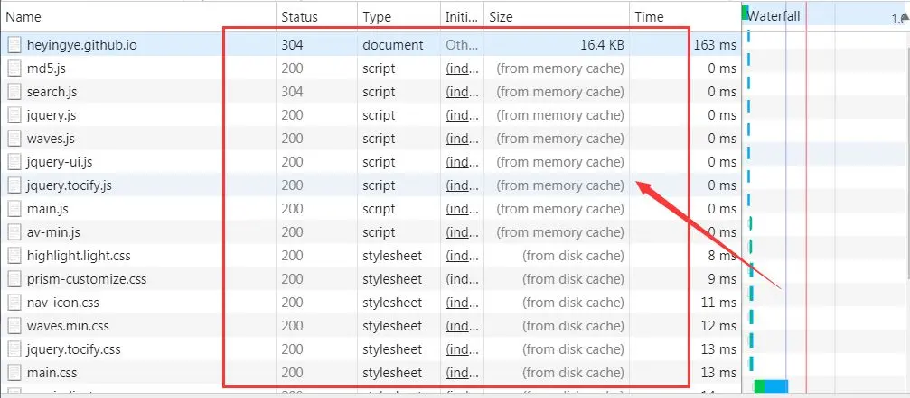

# 浏览器缓存
> 浏览器缓存是浏览器在本地磁盘对用户最近请求过的文档进行存储，当访问者再次访问同一页面时，浏览器就可以直接从本地磁盘加载文档。 浏览器缓存主要分为强缓存（也称本地缓存）和协商缓存（也称弱缓存）。

1. 强缓存 当请求资源的时，如果是之前请求过的并使用强缓存，那么在过期时间内将不会发送本次请求向服务器获取资源，而是直接从浏览器缓存中获取（不管资源是否改动）。过期了将重新从服务器获取，并再次强缓存

2. 协商缓存 当请求资源时，如果是之前请求过的并使用协商缓存，还是发送请求到服务器，服务器通过逻辑判断确认资源没有修改返回304状态码，那么本次的资源则是从缓存中获取；如果经过判断确认资源被修改过，则重新发送资源到客户端，并且客户端更新缓存。

> 判断资源是否修改有两种标准，一种是判断最后修改时间是否变了（确实是修改了，但资源的内容可以没有变），另一种是判断资源的内容是否修改。

## 强缓存
> 强缓存是利用http头中的Expires和Cache-Control两个字段来控制的，Expires是http1.0的规范，Cache-Control是在http1.1中出现的，我们这里使用Cache-Control示范。

> 其中Cache-Control优先级比Expires高

### Expires
> Expires是HTTP/1.0控制网页缓存的字段，其值为服务器返回该请求结果缓存的到期时间，即再次发起该请求时，如果客户端的时间小于Expires的值时，直接使用缓存结果

> 到了HTTP/1.1，Expire已经被Cache-Control替代，原因在于Expires控制缓存的原理是使用客户端的时间与服务端返回的时间做对比，那么如果客户端与服务端的时间因为某些原因（例如时区不同；客户端和服务端有一方的时间不准确）发生误差，那么强制缓存则会直接失效，这样的话强制缓存的存在则毫无意义，那么Cache-Control又是如何控制的呢？

### Cache Control 
> cache Control 字段
      1. private：仅浏览器可以缓存（默认值）
      2. 所有内容只有客户端可以缓存，Cache-Control的默认取值
      3. max-age=xxx：过期时间单位秒
      4. no-cache：不进行强缓存
      5. no-store：不强缓存，也不协商缓存）

    ctx.set('Cache-Control', 'max-age=10')  //设置强缓存，过期时间为10秒

1. HTTP响应报文中expires的时间值，是一个绝对值

2. HTTP响应报文中Cache-Control为max-age=600，是相对值

> 状态码为灰色的请求则代表使用了强制缓存，请求对应的Size值则代表该缓存存放的位置，分别为from memory cache 和 from disk cache

> from memory cache代表使用内存中的缓存，from disk cache则代表使用的是硬盘中的缓存，浏览器读取缓存的顺序为memory –> disk

> 在浏览器中，浏览器会在js和图片等文件解析执行后直接存入内存缓存中，那么当刷新页面时只需直接从内存缓存中读取(from memory cache)；而css文件则会存入硬盘文件中，所以每次渲染页面都需要从硬盘读取缓存(from disk cache)。

## 缓存位置
> 强缓存我们会把资源房放到memory cache 和 disk cache中
> 浏览器缓存时会按顺序查找: Service Worker-->Memory Cache-->Disk Cache-->Push Cache。

  1. Service Worker
      是运行在浏览器背后的独立线程，一般可以用来实现缓存功能。使用 Service Worker的话，
      传输协议必须为 HTTPS。因为 Service Worker 中涉及到请求拦截，所以必须使用 HTTPS 
      协议来保障安全。Service Worker 的缓存与浏览器其他内建的缓存机制不同，它可以让我
      们自由控制缓存哪些文件、如何匹配缓存、如何读取缓存，并且缓存是持续性的

  2. Memory Cache
      内存中的缓存，主要包含的是当前中页面中已经抓取到的资源，例如页面上已经下载的样式、
      脚本、图片等。读取内存中的数据肯定比磁盘快，内存缓存虽然读取高效，可是缓存持续性
      很短，会随着进程的释放而释放。一旦我们关闭 Tab 页面，内存中的缓存也就被释放了。

  3. Disk Cache
      存储在硬盘中的缓存，读取速度慢点，但是什么都能存储到磁盘中，比之 Memory Cache 胜在容量和存储时效性上。
      在所有浏览器缓存中，Disk Cache 覆盖面基本是最大的。它会根据 HTTP Herder 中的字段判断哪些资源需要缓存，哪些
      资源可以不请求直接使用，哪些资源已经过期需要重新请求。并且即使在跨站点的情况下，相同地址的资源一旦被硬盘缓存
      下来，就不会再次去请求数据。绝大部分的缓存都来自 Disk Cache

  4. prefetch cache(预取缓存)
      link标签上带了prefetch，再次加载会出现。
      prefetch是预加载的一种方式，被标记为prefetch的资源，将会被浏览器在空闲时间加载。

  5.  Push Cache
      Push Cache（推送缓存）是 HTTP/2 中的内容，当以上三种缓存都没有命中时，它才会被使用。
      它只在会话（Session）中存在，一旦会话结束就被释放，并且缓存时间也很短暂，在Chrome浏
      览器中只有5分钟左右，同时它也并非严格执行HTTP头中的缓存指令。

作者：黑色的枫
链接：https://juejin.cn/post/6947936223126093861
来源：稀土掘金
著作权归作者所有。商业转载请联系作者获得授权，非商业转载请注明出处。

## 协商缓存
> 协商缓存就是强制缓存失效后，浏览器携带缓存标识向服务器发起请求，由服务器根据缓存标识决定是否使用缓存的过程

    两种结果
    1. 协商缓存生效，返回304
    2. 协商缓存失效，返回200和请求结果结果

> 协商缓存的标识也是在响应报文的HTTP头中和请求结果一起返回给浏览器的，控制协商缓存的字段分别有：Last-Modified / If-Modified-Since和Etag / If-None-Match，其中Etag / If-None-Match的优先级比Last-Modified / If-Modified-Since高

### Last-Modified / If-Modified-Since
> Last-Modified是服务器响应请求时，返回该资源文件在服务器最后被修改的时间

> If-Modified-Since则是客户端再次发起该请求时，携带上次请求返回的Last-Modified值，通过此字段值告诉服务器该资源上次请求返回的最后被修改时间,服务器收到该请求，发现请求头含有If-Modified-Since字段，则会根据If-Modified-Since的字段值与该资源在服务器的最后被修改时间做对比，若服务器的资源最后被修改时间大于If-Modified-Since的字段值，则重新返回资源，状态码为200；否则则返回304，代表资源无更新，可继续使用缓存文件

> 如果命中缓存，则返回304，并且不会返回资源内容，并且不会返回Last-Modify。

### Etag / If-None-Match
> Etag是服务器响应请求时，返回当前资源文件的一个唯一标识(由服务器生成)

> If-None-Match是客户端再次发起该请求时，携带上次请求返回的唯一标识Etag值，通过此字段值告诉服务器该资源上次请求返回的唯一标识值。服务器收到该请求后，发现该请求头中含有If-None-Match，则会根据If-None-Match的字段值与该资源在服务器的Etag值做对比，一致则返回304，代表资源无更新，继续使用缓存文件；不一致则重新返回资源文件，状态码为200

>  当服务器返回304 Not Modified的响应时，由于ETag重新生成过，response header中还会把这个ETag返回，即使这个ETag跟之前的没有变化。

> Etag / If-None-Match优先级高于Last-Modified / If-Modified-Since，同时存在则只有Etag / If-None-Match生效。

## 缓存方案
1. HTML: 协商缓存；
2. css、js、图片：强缓存，文件名带上hash。

## 刷新对于强缓存和协商缓存的影响
1. 当ctrl+f5强制刷新网页时，直接从服务器加载，跳过强缓存和协商缓存。

2. 当f5刷新网页时，跳过强缓存，但是会检查协商缓存。

3. 浏览器地址栏中写入URL，回车 浏览器发现缓存中有这个文件了，不用继续请求了，直接去缓存拿。（最快）

## 总结
> 强制缓存优先于协商缓存进行，若强制缓存(Expires和Cache-Control)生效则直接使用缓存，若不生效则进行协商缓存(Last-Modified / If-Modified-Since和Etag / If-None-Match)，协商缓存由服务器决定是否使用缓存，若协商缓存失效，那么代表该请求的缓存失效，重新获取请求结果，再存入浏览器缓存中；生效则返回304，继续使用缓存

> 参考 https://juejin.cn/post/6844903593275817998?searchId=20240414203613D9AEB8BD2A0FFE34EC1D