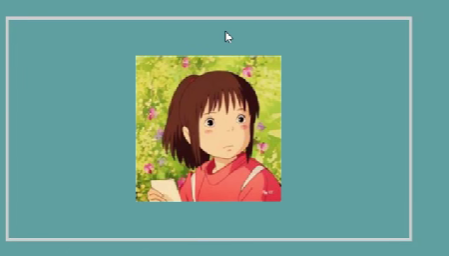

# object-fit
    img {
        object-fit: fill; //默认值填充慢img容器

        object-fit: contain;//保持原始图片宽高比，在不被裁剪情况下
                            //'尽可能填充'img容器
        
        object-fit: cover; //保持宽高比，可能会别裁剪'填充满'img容器

        object-fit: none; //保持原来图片大小，显示在img容器中，如果
                            //图片大与容器会被裁剪 不一定会填充满
                            //容器
                            
        object-fit: scale-down; //会根据图片大小选择是 contain(图片
                                //大于容器)还是none(图片小于容器)

        object-postion: center;// 默认 在容器中居中

        object-postion: right bottom; //在容器的右下角

        object-position:30px 50px; //距离容器左边30px 距离顶部50px

    }
    
 
 
 