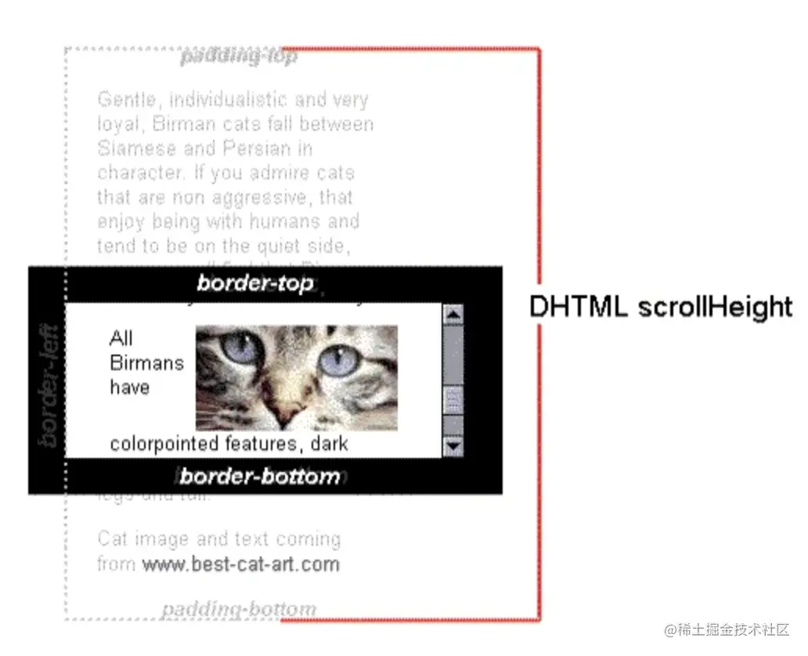
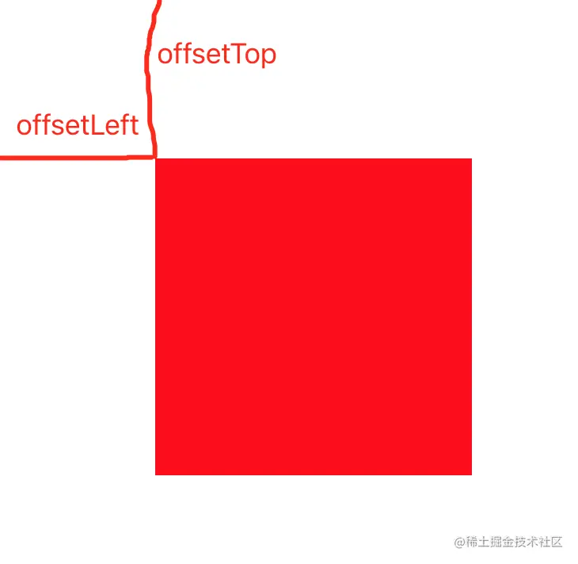

# <a name='获取DOM元素'>获取 DOM 元素</a>

> document.getElementById('id') 通过 id 查找 dom 元素

> document.getElementsByClassName('name')

    1. 通过claa查找dom元素，返回所有匹配的class的元素，它将返回的是以当前元素为根节点，所有指定类名的子元素。返回的是一个集合 HTMLCollection

    2. getElementsByClassName 可以在任何元素上调用，不仅仅是 document。调用这个方法的元素将作为本次查找的根元素

    <button class='btn'>click</button>
    let btn =  document.getElementsByClassName('btn')[0];

    btn.addEventListener('click',()=>{
    console.log('11')
    })

    //获取div2下的p元素
    var div2 = document.getElementById("div2");
    var div2Paras = div2.getElementsByTagName("p");

> document.getElementsByTagName('tagname')

    1. 通过标签名查找dom，返回匹配标签名的所有dom集合
    2. '*'代表所有元素
    3. 折耳根方法返回一个NodeList
    let btn =  document.getElementsByTagName('button')
    btn[0].addEventListener('click',()=>{})

> document.querySelector()

    1、返回文档中与指定选择器或选择器组匹配的第一个 Element对象
    2. 没有匹配到返回null

    document.getElementsByTagName('button')

> document.querySelectorAll()

    1. 返回与指定的选择器组匹配的文档中的元素列表 (使用深度优先的先序遍历文档的节点)。返回的对象是 NodeList 。
    2. 没有匹配返回空的NodeList
    3. 选择器不合法抛出错误

# <a name="给DOM添加样式">给 DOM 添加样式</a>

- 给元素提添加 class

        <button>click</button>

  let btn = document.querySelector('button')
  // 设置元素的 class 为 aaa ，如果元素上原本有 class 则会覆盖
  btn.className = 'aaa'

       // 给Ele新增cctv
       btn.classList.add('cctv')

       // 给Ele新增qwer
       btn.className += 'qwer'

- 给元素添加样式

       btn.style.color = 'red'

- 判断元素上是否有某个属性

  btn.classList.contains("aaa") // 如果 Ele 上面的 class 类名是 aaa 返回 true，否则返回 false

# <a name='操作 DOM 上的属性'>操作 DOM 上的属性</a>

- 判断元素上是否有某个属性

        <button class='aaa'>click</button>

        btn.classList.contains("aaa") // 如果 Ele 上面的 class 类名是 aaa 返回 true，否则返回 false

- 新增属性

        btn.setAttribute("data-id",1)
        <button data-id="1" class='aaa'>click</button>
        //data-id 为自定义属性

- 获取属性的值

        btn.getAttribute("data-id");

- 删除属性

        btn.removeAttribute("data-id");

# <a name="DOM 增删改查">DOM 增删改查</a>

- 创建 DOM

  const p = document.createElement("p");
  //给标签添加内容
  p.innerHTML = 'this is p'

- 插入 DOM

        

        let div = document.querySelector('#root')
        div.appendChild(p)

- 复制 DOM

  let btn = document.querySelector('.btn')
  let btn2 = document.createElement('button')
  btn2 = btn.cloneNode(true)
  div.appendChild(btn2)

- 替换 DOM

> parentElement.replaceChild(newElement,oldElement)
> 用来替换 oldChild 的新节点。如果该节点已经存在于 DOM 树中，则它首先会被从原始位置删除。

        let rep = div.querySelector('button')
        div.replaceChild(p,rep)

> replaceChildren 方法将一个 Node 的后代替换为指定的后代集合。这些新的后代可以为 DOMString 或 Node 对象
> 可以使用 replaceChildren 清空一个元素的后代

    myNode.replaceChildren();

- 删除 DOM

  Element.removeChild(ele)删除 Element 中的 ele 元素

- 遍历 DOM

> parantNode 属性，获取节点的父节点

    document.querySelector('#range').parentNode

> nextSibling 是一个只读属性，返回其父节点的 childNodes 列表中紧跟在其后面的节点，如果指定的节点为最后一个节点，则返回 null。

> previousSibling 查找指定节点的上一个节点

> lastChild 查找指定节点的最后一个字节点

> firstChild 查找指定节点的第一个字节点

> childElementCount 返回子元素的个数，不包括文本节点和注释

> firstElementChild 返回第一个子元素

> lastElementChild 返回最后一个子元素

> previousElementSibling 返回前一个相邻兄弟元素

> nextElementSibling 返回后一个相邻兄弟元素

- 判断元素节点类型

  console.log(box.firstChild.nodeType); // 3 文本
  console.log(box.firstElementChild.nodeType); // 1 元素

# <a name='获取宽高'>获取宽高</a>

- 获取实际屏幕宽高

        const W  =  window.screen.width

        const H = window.screen.height

- 获取浏览器宽高

  const W = window.outerWidth;
  const H = window.outerHeight;

- 获取当前窗口宽高（浏览器视口宽高）

> 打开 f12 ，视口会变小

    const W = window.innerWidth;
    const H = window.innerHeight;

- 获取元素布局样式宽高

  > 不含 margin，包括 border 和 border 里面的内容
  > const W = element.offsetWidth;
  > const H = element.offsetHeight;

- 获取元素内容宽高

  

        const W = element.scrollWidth;
        const H = element.scrollHeight;

- 获取元素被隐藏的宽高

> 一个元素的 scrollTop 值是这个元素的内容顶部（卷起来的）到它的视口可见内容（的顶部）的距离的度量。当一个元素的内容没有产生垂直方向的滚动条，那么它的 scrollTop 值为 0。
> 如果一个元素不能被滚动（例如，它没有溢出，或者这个元素有一个"\*\*non-scrollable"\*\*属性）， scrollTop 将被设置为 0。
> 设置 scrollTop 的值小于 0，scrollTop 被设为 0

        const H = document.documentElement.scrollTop;

        const W = document.documentElement.scrollLeft

- 获取元素距离顶部和左边距离

        const top = Element.offsetTop;
        const left = Element.offsetLeft

# <a name="浏览器原生事件">浏览器原生事件</a>

- 鼠标事件

> 单机事件

        Ele.onclick = function () {
            console.log("onclick");
        };

> 双击事件

        Ele.ondblclick = function () {
            console.log("ondblclick");
        };

> 右击事件

        Ele.oncontextmenu = function () {
            console.log("oncontextmenu");
        };

> 鼠标按下事件

        Ele.onmousedown = function () {
            console.log("onmousedown");
        };

> 鼠标移动事件

        Ele.onmousemove = function () {
            console.log("onmousemove");
        };

> 鼠标滑轮点击事件

        Ele.onmouseup = function () {
            console.log("onmouseup");
        };

> 鼠标移动到元素身上事件

        Ele.onmouseover = function () {
            console.log("onmouseup");
        };

> 鼠标从元素身上离开事件

         Ele.onmouseleave = function () {
            console.log("onmouseleave");
        };

- 键盘事件

1. keydown：当用户按下键盘上的任意键时触发，而且如果按住按住不放的话，会重复触发此事件。
2. keypress：当用户按下键盘上的字符键时触发（就是说用户按了一个能在屏幕上输出字符的按键 keypress 事件才会触发），而且如果按住不放的，会重复触发此事件（按下 Esc 键也会触发这个事件）。
3. keyup：当用户释放键盘上的键时触发。

- 表单事件

1. submit：表单提交
2. reset：表单重置
3. change：值发生改变
4. blur：离焦（不会冒泡）
5. focus：聚焦（不会冒泡）

- window

> window 事件指的是浏览器窗口本身而不是窗口内的文档对象。

1. onload：当文档和资源加载完成后调用
2. unload：当用户离开当前文档转而其他文档时调用
3. resize：浏览器窗口改变

- 其他事件

1. beforeunload：关闭浏览器窗口之前触发的事件

2. DOMContentLoaded：文档对象加载完成之后就触发的事件，无需等待样式、图片等资源

3. readystatechange：document 有 readyState 属性来描述 document 的 loading 状态，readyState 的改变会触发 readystatechange 事件

4. document.readyState === 'complete' 页面已加载完毕

5. document.readyState === 'loading' 页面正在加载

6. pageShow 和 pagehide：每次用户浏览关闭页面时触发

# <a name="时间对象">时间对象</a>

1. toLocaleDateString()：根据本地时间格式，把 Date 对象的日期部分转化为字符串

2. toLocaleTimeString()：根据本地时间格式，把 Date 对象的时间部分转化为字符串

3. toLocaleString()：根据本地时间格式，把 Date 对象转化为字符串

4. getTime()：获取当前时间戳
