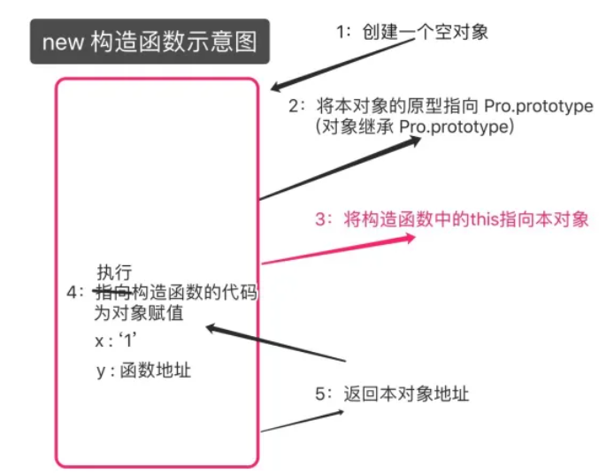

# this 关键字

> 在方法中，this 表示该方法所属的对象

> 1. 如果单独使用，this 表示全局对象。

> 2. 在函数中，this 表示全局对象。

> 3. 在函数中，在严格模式下，this 是未定义的(undefined)。

> 4. 在事件中，this 表示接收事件的元素。

> 5. 类似 call() 和 apply() 方法可以将 this 引用到任何对象。
> 6. 构造函数中的 this 指向构造函数的实例化对象

    1. this永远指向一个对象,
    2. this的指向完全取决于函数调用的位置,

    例
    function fun(){
    console.log(this.s);
    }
    ​
    var obj = {
        s:'1',
        f:fun
    }
    ​
    var s = '2';
    obj.f(); //1
    fun(); //2
    解析：只有在对象中function为一个方法，在方法中this指向方法的拥有者obj。在翻函数中this指向全局对象

## 在构造函数中

# 箭头函数的 this

> 在箭头函数中不绑定 this，但是如果箭头函数使用了 this，会往上层作用域去找，注意：methods 对象并不是作用域(所有的对象都没有作用域)

- 箭头函数没有自己的 this，它的 this 指向上一级作用域的 this

- 隐式绑定对箭头函数无效

  var a = 0
     function foo() {
       let test = () => {
         console.log(this)
      }
       return test
    }
     let obj = { a: 1, foo: foo }
     obj.foo()()
  //obj.foo()返回 test，相当于 test(),这里独立调用，但是 this 还是指向了 obj(也就是箭头函数的上一级 foo 的作用域)

- 显示绑定对箭头函数也是无效

          var a = 0

  function foo() {
       let test = () => {
         console.log(this)
      }
       return test
    }
     let obj1 = {
       a: 1,
       foo: foo
    }
     let obj2 = {
       a: 2,
       foo: foo
    }
     obj1.foo().call(obj2)
  ​
      //obj1.foo()返回 test   obj1.foo.call(obj2)把 test 的指向绑定到 obj2 上，无效，this 依然指向 obj1

# this 指向

- 常用的 thi 是指向

1. 全局作用域中或者普通函数中 this 指向全局对象 window
2. 立即执行函数 this 必定指向 window
3. 定时器 this 指向 window
4. 事件中 this 指向事件源对象
5. 方法中谁调用就指向谁
6. 构造函数中 this 指向对象实例

## this 绑定规则

1. 默认绑定规则

- 默认绑定全局对象 window

  console.log(this === window);   //true

- 全局作用域下独立调用函数，this 指向 window

  function test() {
       console.log(this===window);  //true
    }
     test();

2. 隐式绑定

> 谁调用就指向谁

- 对象调用

      let obj = {
      name: 'obj',
      foo: function () {
        console.log(this);   //this指向obj
        }
        }
        obj.foo()

- 独立调用

  let obj = {
       name: 'obj',
       foo: function () {
         console.log(this);    //obj
         function test() {
           console.log(this);  //window 为什么？ 因为 test 独立调用
        }
         test()
      }
    }
     obj.foo()

- 隐式丢失

  let obj = {
       name: 'obj',
       foo: function () {
         console.log(this);  //window   为什么不是 obj？ bar 拿到 obj.foo 的引用，然后在全局下独立调用
      }
    }
     let bar = obj.foo
     bar()

- 函数作为参数

  function foo() {
       console.log(this);  //window obj.foo 在 bar 函数内独立调用  
    }
     function bar(fn) {
       fn()
    }
     let obj = {
       name: 'obj',
       foo: foo
    }
     bar(obj.foo)

> 父函数有能力决定子函数 this 的指向，例如 forEach 里第一个参数是一个函数，第二个参数就是 this 绑定的对象，不写默认绑定 window

3. 显示绑定

> call、apply、bind bind 返回一个新函数，新函数指向绑定的对象，旧函数不会

4. new 绑定

> this 指向函数实例化之后的对象

5. 绑定优先级

> new 绑定 > 显式绑定 > 隐式绑定 > 默认绑定
