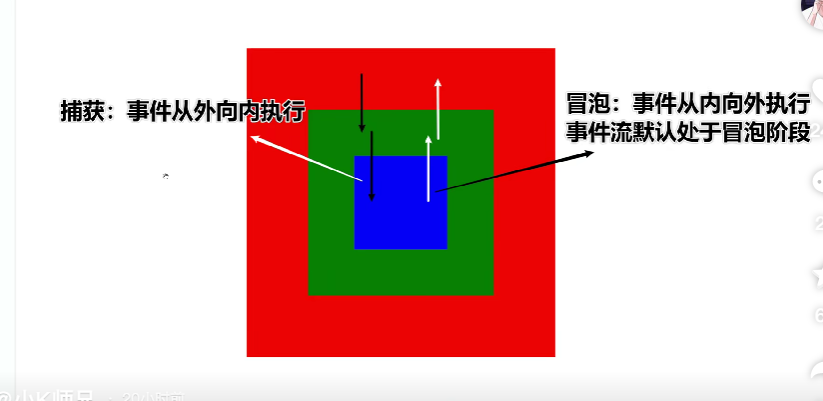

# 事件冒泡

> 事件从内向外执行，事件默认处于冒泡阶段

    e.stopPropagation()可以阻止事件冒泡

    thing.addEventListener('click',(e)=>{
        console.log('')
        e.stopPropagation()
    })

## 捕获

> 事件由外向内执行

    让事件处于捕获状态
    thing.addEventListener('click',()=>{
        console.log('')
    },true)
    //第三个参数true是开启事件捕获

<strong style="color: red; font-size: 20px">捕获的优先权比冒泡高</strong>

    

        

            

        

    

    blue.addEventListener('click',(e)=>{
        console.log('blue')

    }) //冒泡

    green.addEventListener('click',(e)=>{
        console.log('green')

    },true) //捕获

    red.addEventListener('click',(e)=>{
        console.log('red')

    }) //冒泡

    // 输出内容green blue red
