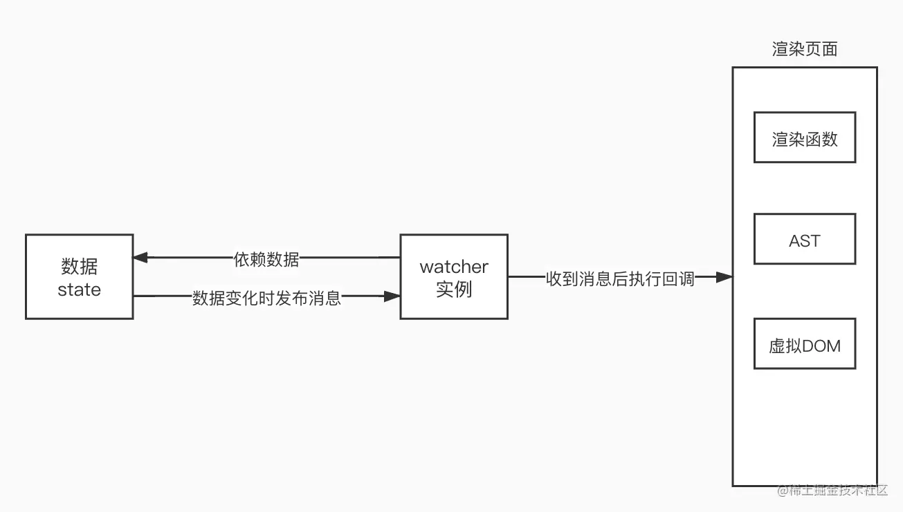

# 数据响应式

> 是为了数据驱动视图更新
> vue 采用数据劫持结合发布订阅-订阅者模式的方式，通过拦截对数据的操作，在数据变动时发布给订阅者，触发响应的监听回调

1. 数据劫持: 当数据发生变化时，我们可以做一些特定的事情
2. 依赖收集: 我们要清楚视图层依赖那些数据(state)
3. 派发更新: 数据变化，通知依赖这些的数据的 dom 更新

## 数据劫持原理

> vue 使用 object.defineProperty()来进行数据劫持

### Object.defineProperty

> Object.defineProperty(obj, prop, descriptor)

        obj是要定义的属性对象
        prop是指定要定义或者修改的属性 类型为symbol
        descriptor是定义或者修改的属性的描述符

> Object.defineProperty 可以精确的添加或修改属性
> 默认情况下，Object.defineProperty 添加的属性不可写，不可枚举，不可配置
> Object.defineProperty() 使用 [[DefineOwnProperty]] 内部方法，而不是 [[Set]]，因此即使属性已经存在，它也不会调用 setter。

            // 入口函数
        function observe(data) {
        if (typeof data !== 'object') return
        // 调用Observer
        new Observer(data)
        }

        class Observer {
        constructor(value) {
            this.value = value
            this.walk()
        }
        walk() {
            // 遍历该对象，并进行数据劫持
            Object.keys(this.value).forEach((key) => defineReactive(this.value, key))
        }
        }

        function defineReactive(data, key, value = data[key]) {
        // 如果value是对象，递归调用observe来监测该对象
        // 如果value不是对象，observe函数会直接返回
        observe(value)
        Object.defineProperty(data, key, {
            get: function reactiveGetter() {
            return value
            },
            set: function reactiveSetter(newValue) {
            if (newValue === value) return
            value = newValue
            observe(newValue) // 设置的新值也要被监听
            }
        })
        }

        const obj = {
        a: 1,
        b: {
            c: 2
        }
        }

        observe(obj)

### 属性描述符

> 描述符两种：

1. 属性描述符 是一个具有可写或者不可写值的属性
2. 访问器描述符 是由 getter/setter 函数对描述的属性

> 描述符只能是这两种类型之一，不能同时存在
> 数据 描述符和访问器描述符都是对象，他们共享以下可选建
> Object.defineProperty() 定义属性的情况下，下述所有键都是默认值
> 默认情况下，都为 false
> 可以使用 Object.defineProperties(),一次定义多个属性
> 可以使用 Object.getOwnPropertyDescriptor() 获取指定属性的属性描述符(具体查看 js/Object 文件下的 Object.defineProperty().md)

    1. configurable
        为false时
            该属性类型不能在数据属性和访问器属性之间更改
            该属性不可删除
            描述符的其他属性也不能更改(但是，如果它是一个可写的数据描述符，则 value 可以被更改，writable 可以更改为 false)
        默认为false

    2. enumerable
     当且仅当该属性在对应的对象的属性枚举时出现 值为true 默认为false

    数据描述符还具有以下可选键值

    3. value
        与属性相关联的值，可以使有效的js值(数字，对象，函数等) 默认为undefined

    4.writable
        如果与属性相关联的值可以使用赋值运算符更改，则为 true。默认值为 false

    访问器描述符还具有一下可选键值

        5.get
            用作属性 getter 的函数，如果没有 getter 则为 undefined。当访问该属性时，将不带参地调用此函数，并将 this 设置为通过该属性访问的对象（因为可能存在继承关系，这可
            能不是定义该属性的对象）。返回值将被用作该属性的值。默认值为 undefined。

        6. set
            用作属性 setter 的函数，如果没有 setter 则为 undefined。当该属性被赋值时，将调用此函数，并带有一个参数（要赋给该属性的值），并将 this 设置为通过该属性分配的对象。默认值为 undefined。

> 如果描述符没有 value、writable、get 和 set 键中的任何一个，它将被视为数据描述符
> 如果描述符同时具有 [value 或 writable] 和 [get 或 set] 键，则会抛出异常。
> 这些属性不一定是描述符本身的属性。继承的属性也会被考虑在内。为了确保这些默认值得到保留，你可以预先冻结描述符对象原型链中的现有对象，明确指定所有选项，或使用 Object.create(null) 指向 null。

    当当前属性是可配置的时，将特性设置为 undefined 可以有效地删除它。例如，如果 o.k 是一个访问器属性，Object.defineProperty(o, "k", { set: undefined }) 将删除 setter，使 k 只有 getter 并变成只读的。如果新描述符中缺少一个特性，则会保留旧描述符该特性的值（不会被隐式重新设置为 undefined）。通过提供不同类型的描述符，可以在数据属性和访问器属性之间切换。例如，如果新描述符是数据描述符（带有 value 或 writable），则原始描述符的 get 和 set 属性都将被删除。

## 收集依赖和派发更新

概括流程图

    每个watcher实例订阅一个或者多个数据，这些数据被称为watcher的依赖，当依赖发生变化，watcher实例会接受到数据发生变化的消息，之后会执行回调函数来实现功能

> 用一个数组来存储 watcher
> watcher 实例需要订阅数据，也就是获取依赖或者收集依赖
> watcher 的依赖发生变化时触发一个 watcher 的回调函数，也就是派发更新
> 每个数据都应该维护一个自己的数组，改数组存放自己的 watcher，可以在 defineReactive 中定义一个数组 dep，通过闭包，每个属性都能拥有一个自己的数组

            function defineReactive(data, key, value = data[key]) {
            const dep = [] // 增加
            observe(value)
            Object.defineProperty(data, key, {
                get: function reactiveGetter() {
                    return value
                },
                set: function reactiveSetter(newValue) {
                    if (newValue === value) return
                        value = newValue
                        observe(newValue)
                        dep.notify()
                }
            })
            }

### 依赖收集

    渲染引擎在解析模板的时候遇到插值表达式，v-bind等数据的地方会实例化一个watcher，new watcher是会触发constructor，constructor的get方法被调用，
        get() {
            window.target = this // 新增
            const value = parsePath(this.data, this.expression)
            return value
            }
    get方法会对数据求值，并且将watcher实例对象放到全局，求值触发数据的getter，getter会将依赖它的watcher 实例收集到dep数组中，
        get: function reactiveGetter() {
            dep.push(window.target) // 新增
            return value
            }

            //注意，不能这样写window.target = new Watcher()。因为执行到getter的时候，实例化watcher还没有完成，所以window.target还是undefined

    这样就可以拿到依赖的watcher实例对象(在全局中拿到)，getter执行完毕，watcher的get执行完，并返回值，constructor执行完毕，实例化完毕

> 使用者方法在没遇到一个插值表达式都会 new 一个 watcher，这样每个节点都会有一个 watcher 这是 vue1.x 的做法(以节点为单位更新)，vue2.x 是每个组件对应一个 watcher，实例化不是传一个 expression，而是渲染函数

### 派发更新

    在修改数据时触发setter，setter调用依赖的watcher实例的update方法来实现更新
    set: function reactiveSetter(newValue) {
    if (newValue === value) return
    value = newValue
    observe(newValue)
    dep.forEach(d => d.update()) // 新增 update方法见Watcher类
    }

# 优化

## dep

> 将 dep 抽象为一个类

        class Dep {
        constructor() {
            this.subs = []
        }

        depend() {
            this.addSub(Dep.target)
        }

        notify() {
            const subs = [...this.subs]
            subs.forEach((s) => s.update())
        }

        addSub(sub) {
            this.subs.push(sub)
        }
        }

> definReactive

        function defineReactive(data, key, value = data[key]) {
        const dep = new Dep() // 修改
        observe(value)
        Object.defineProperty(data, key, {
            get: function reactiveGetter() {
            dep.depend() // 修改
            return value
            },
            set: function reactiveSetter(newValue) {
            if (newValue === value) return
            value = newValue
            observe(newValue)
            dep.notify() // 修改
            }
        })
        }

## window.target

    get() {
        window.target = this // 设置了window.target
        const value = parsePath(this.data, this.expression)
        return value
        }

> 如果有 obj:{a:1,b:2}，会先 new watcher01，然后在 get window.target 为 watcher01 的实例，
> 在 new watcher02 时，此时 window.targer 还是 watcher01 的实例，为了解决这个问题

        get() {
        window.target = this
        const value = parsePath(this.data, this.expression)
        window.target = null // 新增，求值完毕后重置window.target
        return value
        }

        // Dep的depend方法
        depend() {
        if (Dep.target) { // 新增
            this.addSub(Dep.target)
        }
        }

> window.target 的含义就是当前执行上下文中的 watcher 实例。由于 js 单线程的特性，同一时刻只有一个 watcher 的代码在执行，因此 window.target 就是当前正在处于实例化过程中的 watcher

## update

> 我们可以在定义的回调中访问 this，并且该回调可以接收到监听数据的新值和旧值，因此做如下修改

        update() {
            const oldValue = this.value
            this.value = parsePath(this.data, this.expression)
            this.cb.call(this.data, this.value, oldValue)//回调函数拿到新的值
            }

# target

> 我们有两个嵌套的父子组件，渲染父组件时会新建一个父组件的 watcher，渲染过程中发现还有子组件，就会开始渲染子组件，也会新建一个子组件的 watcher。在我们的实现中，新建父组件 watcher 时，window.target 会指向父组件 watcher，之后新建子组件 watcher，window.target 将被子组件 watcher 覆盖，子组件渲染完毕，回到父组件 watcher 时，window.target 变成了 null，这就会出现问题，因此，我们用一个栈结构来保存 watcher。

    const targetStack = []

    function pushTarget(_target) {
        targetStack.push(window.target)
        window.target = _target
    }

    function popTarget() {
        window.target = targetStack.pop()
    }

    watcher中的get
        get() {
            pushTarget(this) // 修改
            const value = parsePath(this.data, this.expression)
            popTarget() // 修改
            return value
        }
